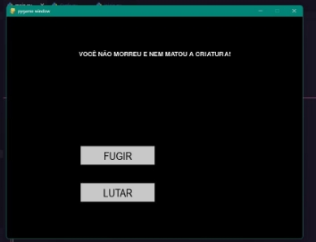

Projeto de Implementação – Algoritmo Em Grafos 

Allan Pereira Fenelon       Lucas Vinicius Santos Leonel Leandro Roberto De Sousa 

1. **Bibliotecas Usadas** 

Nesta seção mostraremos as bibliotecas que foram utilizadas. O objetivo é mostrar as bibliotecas que são necessárias para a execução do jogo, pois sem elas o jogo não executará. As bibliotecas usadas estão sendo usadas na versão do Python 3.12.2. Distinção de versão não garante a boa execução do código. 

O game foi desenvolvido com a biblioteca Pygame 2.5.2. Foi utilizado a biblioteca do pandas para a leitura do CSV com os dados dos vértices do grafo. 

2. **Como Utilizar** 

No Visual Studio Code, você deve abrir a pasta nomeada de Grafos. Em seguida execute o arquivo main.py. Como o solicitado, o personagem se moverá sozinho, tendo como uma das únicas iterações com quem está executando o código clicar em uma das opções com botões quando aparecer na tela. 

Há duas situações neste caso: Quando a luta acaba mais ninguém morreu e quando o personagem morre, neste é possível escolher entre desistir do jogo e recomeçar. 

3. **Algumas informações sobre o Grafo** 

O Grafo é lido através de um CSV em Arquivos>data>vertices.csv bem como suas arestas Arquivos>data>arestas.csv. O grafo tem  a seguinte estruturação  e a qual  foi inserida no mapa: 

Esta é uma organização plotada com o Matplotlib, é apenas algo visual e não considerando  nenhuma  coordenada  de  cada  vértice,  mas  com  essa  representação  é possível ver cada ligação a cada local do mapa. 

4. **Algumas Telas** 

**Tela inicial** 

**Tela do jogo** 

**Tela Luta** 

**Tela Fugir ou Lutas** 

**Tela matou criatura** 

**Tela de GameOver** 

5. **Links para os vídeos** 

   **Allan:** 

   [` `**https://youtu.be/XpIv-vkWMBI** ](https://youtu.be/XpIv-vkWMBI)

   **Lucas: [https://www.youtube.com/watch?si=8NF4wXnptNx3Wp 9D&v=07AKaTInGTk&feature=youtu.be** ](https://www.youtube.com/watch?si=8NF4wXnptNx3Wp9D&v=07AKaTInGTk&feature=youtu.be)**

   **Leandro: [https://www.youtube.com/watch?v=WW9MEbtwBb4** ](https://www.youtube.com/watch?v=WW9MEbtwBb4)**
